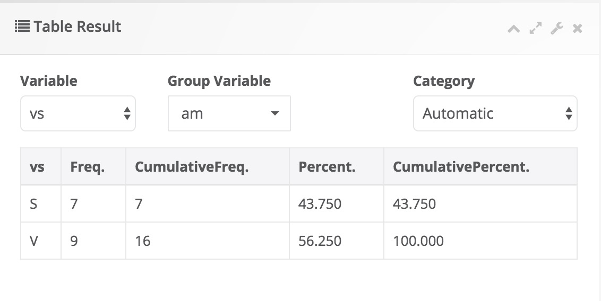

.. Assumptions / Limitations

Descriptives
===========================

Descriptive panel is used to summarize a sample or a collection of data. It gives information about three different aspects of distribution of a single variable, including location (mean, trimmed mean, harmonic mean, geometric mean, median, quartiles, mode), scale (standard deviation, variance, standard error of mean, range) and shape (skewness, kurtosis).

Descriptive Statistics
----------------------

How to select this module?
~~~~~~~~~~~~~~~~~~~~~~~~~~

Descriptives - Descriptive Statistics  

General aim
~~~~~~~~~~~~~~~~~~~~~~~~~~

- Descriptive statistics is used to summarize a sample or a collection of data. It gives information about three different aspects of distribution of a single variable, including location (mean, trimmed mean, harmonic mean, geometric mean, median, quartiles, mode), scale (standard deviation, variance, standard error of mean, range) and shape (skewness, kurtosis).

What can you do using this module?
~~~~~~~~~~~~~~~~~~~~~~~~~~~~~~~~~~

- Compute descriptive statistics, including location; mean, trimmed mean, harmonic mean, geometric mean, median, quartiles, mode, scale; standard deviation, variance, standard error of mean, range, shape measures; skewness, kurtosis and other summary measures; number, sum, minimum, maximum to describe the distribution of one or more numerical (continuous or discrete) variables
- Display the data distribution of variables with interactive plots, including box-plot and histogram.
- Test whether the data distributes normally or not using Shapiro-Wilk’s test.

Usage
~~~~~~

Step 1: Define your variables from "Variables" tab:

- Select numerical variable(s) of interest(s) for descriptive statistics.
- Select group variable(s) if necessary.
- Click Run button to execute the analysis.

----------------------------------

.. figure:: images/help_img/descriptiveStatistics/variables.jpg
    :align: center
    :height: 400
    :width: 400
    :alt: descriptiveStatisticsVariablesTab

---------------------------------

.. note:: You may choose more options using following tabs:

"Statistics" tab

- Select one or more availabe statistics.
- Check the box for Shapiro-Wilk's normality test

----------------------------------

.. figure:: images/help_img/descriptiveStatistics/statistics.jpg
    :align: center
    :height: 750
    :width: 750
    :alt: descriptiveStatisticsStatisticsTab

---------------------------------

"Graphs" tab

- Select one or more availabe graphs: Histogram and Box Plot

----------------------------------

.. figure:: images/help_img/descriptiveStatistics/graphs.jpg
    :align: center
    :height: 650
    :width: 650
    :alt: descriptiveStatisticsGraphTab

---------------------------------

"Options" tab

- Calculate quartiles and percentiles.
- Manage missing values with either complete case or by variable deletion.
- Choose display option for grouping with either seperate or joint display.
- Add confidence interval.
- Set the trim value to trim your variable(s).

----------------------------------

.. figure:: images/help_img/descriptiveStatistics/options.jpg
    :align: center
    :height: 650
    :width: 650
    :alt: descriptiveOptionsTab

---------------------------------

Step 2: Get your desired outputs

- Display table with desired descriptive statistics.
- Switch between variables using combo-box button.

----------------------------------

.. figure:: images/help_img/descriptiveStatistics/tableResults.jpg
    :align: center
    :height: 650
    :width: 650
    :alt: descriptiveStatisticsTableResults

---------------------------------

- Display Shapiro-Wilk's Normality Test result.

----------------------------------

.. figure:: images/help_img/descriptiveStatistics/testResults.jpg
    :align: center
    :height: 650
    :width: 650
    :alt: descriptiveStatisticsTestResults

---------------------------------

- Display interactive plots:

- Box plot

----------------------------------

.. figure:: images/help_img/descriptiveStatistics/boxplot.jpg
    :align: center
    :height: 650
    :width: 650
    :alt: descriptiveStatisticsBoxplot

----------------------------------

- Histogram.

----------------------------------

.. figure:: images/help_img/descriptiveStatistics/histogram.jpg
    :align: center
    :height: 650
    :width: 650
    :alt: descriptiveStatisticsHistogram

----------------------------------

Frequencies
-----------

How to select this module?
~~~~~~~~~~~~~~~~~~~~~~~~~~

Descriptives - Frequencies

General aim
~~~~~~~~~~~~~~~~~~~~~~~~~~

- The frequency is defined as the number of occurrence in the event of the interest. This measure can be calculated as count and percentage for categorical variables and introduced as frequency table.

What can you do using this module?
~~~~~~~~~~~~~~~~~~~~~~~~~~~~~~~~~~

- Compute several descriptive statistics to describe the distribution of categorical data.
- Test whether the distribution of data categories is equal or not.
- Display the data distribution with interactive plots, including bar and pie graphs.

Usage
~~~~~~

Step 1: Define your variables from "Variables" tab:

- Select categorical variable(s) of interest(s) for descriptive statistics.
- Select group variable(s) if necessary.
- Click Run button to execute the analysis.

----------------------------------

---------------------------------

.. note:: You may choose more options using following tabs:

"Statistics" tab

- Select one or more availabe statistics.
- Check the box for Goodness of Fit (GoF) test for equality of proportions.

----------------------------------

.. figure:: images/help_img/frequencies/statistics.jpg
    :align: center
    :height: 750
    :width: 750
    :alt: frequenciesStatisticsTab

---------------------------------

"Graphs" tab

- Select the availabe graph: Bar Graph and Pie Graph
- Graphs may be plotted based on counts or percentages.

----------------------------------

.. figure:: images/help_img/frequencies/graphs.jpg
    :align: center
    :height: 650
    :width: 650
    :alt: frequenciesGraphsTab

---------------------------------

"Options" tab

- Change the alpha level, default is 0.05.
- Check the box if you want to display frequency tables separately for each variable.

----------------------------------

---------------------------------

Step 2: Get your desired outputs

- Display table with desired descriptive statistics.
- Switch between variables using combo-box button.

----------------------------------

---------------------------------

- Display Goodness of Fit test or equality of proportions.

----------------------------------

---------------------------------

- Display interactive plots:

- Box plot

----------------------------------

.. figure:: images/help_img/frequencies/barPlot.jpg
    :align: center
    :height: 650
    :width: 650
    :alt: frequenciesBarPlot

----------------------------------

Contingency Tables
------------------

How to select this module?
~~~~~~~~~~~~~~~~~~~~~~~~~~

Descriptives - Contingency Tables

General aim
~~~~~~~~~~~~~~~~~~~~~~~~~~

- This module includes several categorical data analysis methods such as chi-square analysis, risk measures and Kappa tests. In this module, you can explore whether there is a significant relationship between two categorical variables. Moreover, you can display whether there is a significant relationship between categorical variables with interactive plots.

What can you do using this module?
~~~~~~~~~~~~~~~~~~~~~~~~~~~~~~~~~~

- Compute several descriptive statistics to describe the distribution of categorical data.
- Test whether the distribution of data categories is equal or not.
- Display the data distribution with interactive plots, including bar and pie graphs.

Usage
~~~~~~

Step 1: Define your variables from "Variables" tab:

- Select row variable(s) and column variables.
- Select group variable(s) if necessary.
- Click Run button to execute the analysis.

----------------------------------

.. figure:: images/help_img/contingencyTables/variables.jpg
    :align: center
    :height: 400
    :width: 400
    :alt: contingencyTablesVariables

---------------------------------

.. note:: You may choose more options using following tabs:

"Statistics" tab

- Select one or more tests or association measures.

----------------------------------

.. figure:: images/help_img/contingencyTables/statistics.jpg
    :align: center
    :height: 750
    :width: 750
    :alt: contingencyTablesStatistics

---------------------------------

"Graphs" tab

- Selet Bar Graph to draw a plot.

----------------------------------

.. figure:: images/help_img/contingencyTables/graphs.jpg
    :align: center
    :height: 650
    :width: 650
    :alt: contingencyTablesGraphs

---------------------------------

"Options" tab

- Select options for Chi-square test: Continuity Correction, Exact chi-square.
- Display row, column or total percentages.
- Choose display option for grouping with either seperate or joint display.
- Select one or more table options to display expected values, raw residuals, pearson residuals, standardized residuals, adjusted residuals, and cell chisquare values.

----------------------------------

.. figure:: images/help_img/contingencyTables/options.jpg
    :align: center
    :height: 650
    :width: 650
    :alt: contingencyTablesOptions

---------------------------------

Step 2: Get your desired outputs

- Display desired cross tables.
- Switch between variables and table representations using combo-box button.

----------------------------------

.. figure:: images/help_img/contingencyTables/tableResults.jpg
    :align: center
    :height: 650
    :width: 650
    :alt: contingencyTablesTableResults

---------------------------------

- Display desired test result table. 

----------------------------------

.. figure:: images/help_img/contingencyTables/testResults.jpg
    :align: center
    :height: 650
    :width: 650
    :alt: contingencyTestResults

---------------------------------

- Display interactive bar plot:

----------------------------------

.. figure:: images/help_img/contingencyTables/barPlot.jpg
    :align: center
    :height: 650
    :width: 650
    :alt: contingencyBarPlot

----------------------------------

Normality Tests
------------------

How to select this module?
~~~~~~~~~~~~~~~~~~~~~~~~~~

Descriptives - Normality Tests

General aim
~~~~~~~~~~~~~~~~~~~~~~~~~~

- This module includes descriptive statistics, normality tests and graphical approaches for assessing univariate normality of a continuous variable. A Box-Cox transformation can be performed for non-normally distributed variables and normality can be checked after transformation. 

What can you do using this module?
~~~~~~~~~~~~~~~~~~~~~~~~~~~~~~~~~~

- Compute several descriptive statistics (mean, median, first quartile, third quartile, skewness, kurtosis) to describe the distribution of a continuous variable.
- Perform hypothesis tests (Shapiro-Wilk, Anderson-Darling, Kolmogorov-Smirnov, Shapiro-Francia, Cramer-von-Mises, Lilliefors) for univariate normality of a continuous variable.
- Display the data distribution with interactive plots, including qq plot, box plot and histogram.

Usage
~~~~~~

Step 1: Define your variables from "Variables" tab:

- Select continuous variable(s) you wish to assess univariate normality.
- Select group variable(s) if necessary.
- Click Run button to execute the analysis.

----------------------------------

.. figure:: images/help_img/normalityTests/variables.jpg
    :align: center
    :height: 400
    :width: 400
    :alt: normalityTestsTablesVariables

---------------------------------

.. note:: You may choose more options using following tabs:

"Statistics" tab

- Select one or more univariate normality tests.

----------------------------------

.. figure:: images/help_img/normalityTests/statistics.jpg
    :align: center
    :height: 750
    :width: 750
    :alt: normalityTestsTablesStatistics

---------------------------------

"Graphs" tab

- Selet one or more interactive graphs: QQ plot, Box plot, Histogram. 

----------------------------------

.. figure:: images/help_img/normalityTests/graphs.jpg
    :align: center
    :height: 650
    :width: 650
    :alt: normalityTestsTablesGraphs

---------------------------------

"Options" tab

- Change the alpha level, default is 0.05.
- Check the box if you wish to perform a Box-Cox transformation.

----------------------------------

---------------------------------

Step 2: Get your desired outputs

- Display descriptive statistics
- Switch between variables and table representations using combo-box button.

----------------------------------

.. figure:: images/help_img/normalityTests/tableResults.jpg
    :align: center
    :height: 650
    :width: 650
    :alt: normalityTestsTableResults

---------------------------------

- Display desired test result table. 

----------------------------------

.. figure:: images/help_img/normalityTests/testResults.jpg
    :align: center
    :height: 650
    :width: 650
    :alt: normalityTestsTestResults

---------------------------------

- Display interactive QQ plot:

----------------------------------

.. figure:: images/help_img/normalityTests/qqPlot.jpg
    :align: center
    :height: 650
    :width: 650
    :alt: normalityTestsQQPlot

----------------------------------

Outlier Detection
------------------

How to select this module?
~~~~~~~~~~~~~~~~~~~~~~~~~~

Descriptives - Outlier Detection

General aim
~~~~~~~~~~~~~~~~~~~~~~~~~~

- This module includes several statistical methods for detection of outliers in continuous variables.

What can you do using this module?
~~~~~~~~~~~~~~~~~~~~~~~~~~~~~~~~~~

- Compute descriptive statistics, including mean, standard deviation, standard error of mean, lower and upper limits.
- Perform normality test (Shapiro-Wilk) and outlier detection tests (Z-score method, quantile method, Grubb's test, Generalized ESD test).
- Display the data distribution with interactive box-plots.

Usage
~~~~~~

Step 1: Define your variables from "Variables" tab:

- Select continuous variable(s) you wish to assess univariate normality.
- Select group variable(s) if necessary.
- Click Run button to execute the analysis.

----------------------------------

.. figure:: images/help_img/outlierDetection/variables.jpg
    :align: center
    :height: 400
    :width: 400
    :alt: normalityTestsTablesVariables

---------------------------------

.. note:: You may choose more options using following tabs:

"Statistics" tab

- Select one or more univariate normality tests.

----------------------------------

.. figure:: images/help_img/outlierDetection/statistics.jpg
    :align: center
    :height: 750
    :width: 750
    :alt: normalityTestsTablesStatistics

---------------------------------

"Graphs" tab

- Selet one or more interactive graphs: QQ plot, Box plot, Histogram. 

----------------------------------

.. figure:: images/help_img/outlierDetection/graphs.jpg
    :align: center
    :height: 650
    :width: 650
    :alt: normalityTestsTablesGraphs

---------------------------------

"Options" tab

- Change the alpha level, default is 0.05.
- Check the box if you wish to perform a Box-Cox transformation.

----------------------------------

.. figure:: images/help_img/outlierDetection/options.jpg
    :align: center
    :height: 650
    :width: 650
    :alt: normalityTestsTablesOptions

---------------------------------

Step 2: Get your desired outputs

- Display descriptive statistics
- Switch between variables and table representations using combo-box button.

----------------------------------

.. figure:: images/help_img/outlierDetection/tableResults.jpg
    :align: center
    :height: 650
    :width: 650
    :alt: normalityTestsTableResults

---------------------------------

- Display normality test and outlier results. 

----------------------------------

.. figure:: images/help_img/outlierDetection/testResultsNormality.jpg
    :align: center
    :height: 650
    :width: 650
    :alt: normalityTestsTestResults

    
.. figure:: images/help_img/outlierDetection/testResultsOutlier.jpg
    :align: center
    :height: 650
    :width: 650
    :alt: normalityTestsTestResults

---------------------------------

- Display interactive box plot:

----------------------------------

.. figure:: images/help_img/outlierDetection/boxPlot.jpg
    :align: center
    :height: 650
    :width: 650
    :alt: normalityTestsQQPlot

----------------------------------

Correlation
-----------

There are some inherent limitations of Exordium, based on the assumptions
that have been made during its development (and in my own music library).

- The artist name "Various" is reserved.  Tracks with an artist tag of
  "Various" will not be added to the library.

