.. Assumptions / Limitations

Nonparametric Tests
===========================

‘Parametric Tests’ panel is used to estimate the population parameters (e.g. mean, variance and proportion) and compare them between groups, time points or user-specified custom values, when the parametric assumptions are met. Required test assumptions (e.g. data normality, variance homogeneity) are also available in each module, to assist the users on their decision to perform (or not perform) the right test module.

Randomness Test
---------------

How to select this module?
~~~~~~~~~~~~~~~~~~~~~~~~~~

Parametric Tests 

Randomness Test

General aim
~~~~~~~~~~~~~~~~~~~~~~~~~~

- ‘Randomness’ module is useful to analyze the distribution of data to check whether it is random (patternless) or not.

What can you do using this module?
~~~~~~~~~~~~~~~~~~~~~~~~~~~~~~~~~~

- Compute several descriptive statistics to describe the distribution of categorical data and estimate the proportion of the population
- Test whether the data is random around the mean, median, mode statistics or a user-specified value
- Use asymptotic or exact test procedures in computation of p values
- Display the data distribution of variables with randomness plot

Usage
~~~~~~

Step 1: Define your variables from "Variables" tab:

- Select categorical variable(s) of interest(s) for descriptive statistics and comparison
- Change the test value if necessary (to test whether the data is random around the mean, median, mode statistics or a user-specified value)

----------------------------------

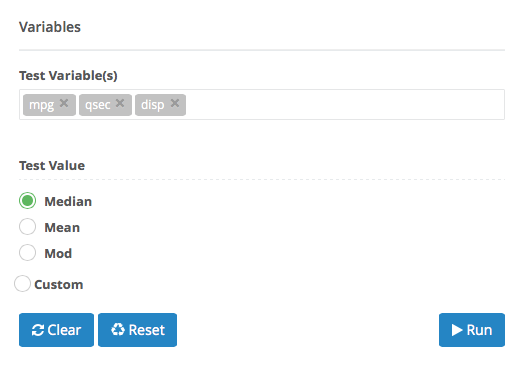

---------------------------------

.. note:: You may choose more options using following tabs:

"Statistics" tab

- Choose one or more available randomness tests: Walf-Wolfovitz runs, Mann-Kendall rank or Bartel tests
- Select the type of alternative hypothesis
- Define the confidence level for hypothesis testing

----------------------------------

.. figure:: images/help_img/nonparametricTests/randomnessTest/statistics.png
    :align: center
    :height: 750
    :width: 750
    :alt: randomnessTestStatistics

---------------------------------

"Graphs" tab

- Select Randomness plot
- Display the threshold line in the plot

----------------------------------

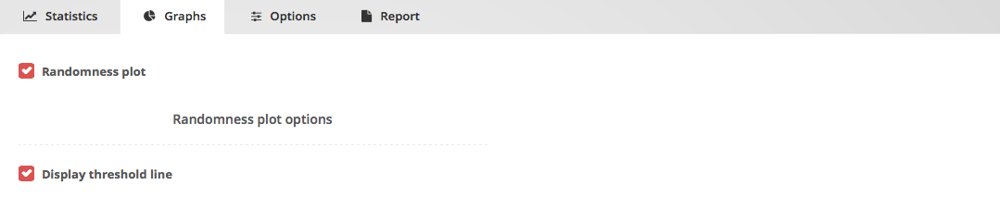

---------------------------------

"Options" tab

- Choose p value computation option as asymptotic or exact

----------------------------------

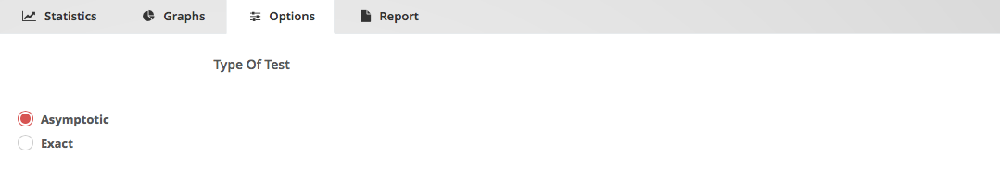

---------------------------------

Step 2: Get your desired outputs

- Display table with the descriptive statistics of the selected variables
- Switch between variables using combo-box button
- Click ‘Show All’ to display results for all variables in same screen

----------------------------------

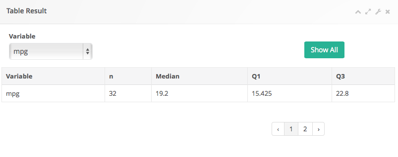

---------------------------------

- Display the Randomness Test results

----------------------------------

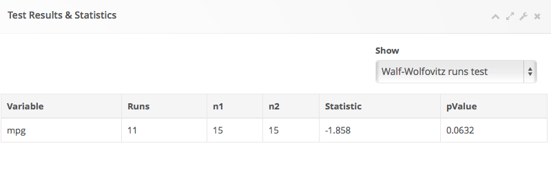

---------------------------------

- Display interactive plots:
- Randomness Plot

----------------------------------

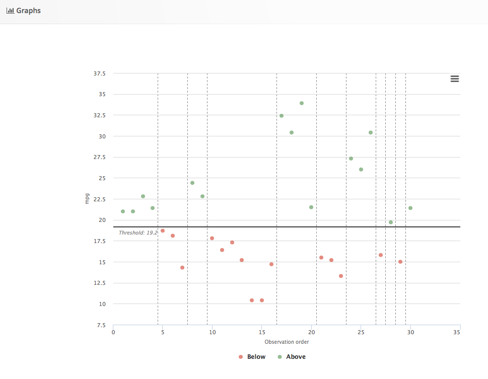

----------------------------------

One Sample Test
---------------

How to select this module?
~~~~~~~~~~~~~~~~~~~~~~~~~~

Parametric Tests 

One Sample Test

General aim
~~~~~~~~~~~~~~~~~~~~~~~~~~

- This module can be used to estimate the median of the population and compare whether the data distribution differs from a specified reference value.

What can you do using this module?
~~~~~~~~~~~~~~~~~~~~~~~~~~~~~~~~~~

- Compute several descriptive statistics to describe the distribution of categorical data and estimate the proportion of the population
- Compare the data distribution with a specified reference value
- Display the data distribution of variables with interactive boxplots
- Test whether the data distributed normally or not using Shapiro-Wilk’s test

Usage
~~~~~~

Step 1: Define your variables from "Variables" tab:

- Select categorical variable(s) of interest(s) for descriptive statistics and comparison
- Enter the test value (the median to be compared)

----------------------------------

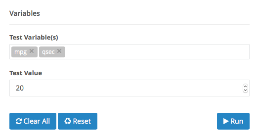

---------------------------------

.. note:: You may choose more options using following tabs:

"Statistics" tab

- Choose one or more available comparison tests: Wilcoxon or sign tests
- Check the box for Shapiro-Wilk’s normality test
- Select the type of alternative hypothesis
- Define the confidence level for hypothesis testing

----------------------------------

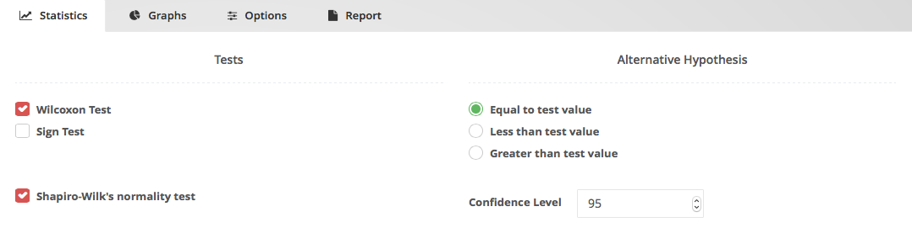

---------------------------------

"Graphs" tab

- Select Box Plot
- Identify what the error bars will represent: confidence intervals, standard errors or standard deviations

----------------------------------

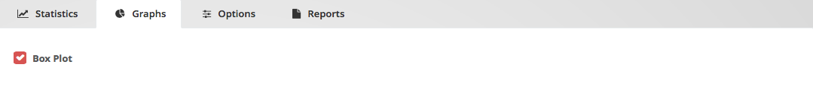

---------------------------------

"Options" tab

- Choose p value computation option as asymptotic or exact

----------------------------------

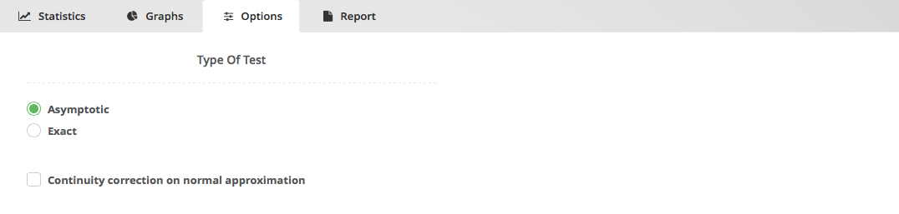

---------------------------------

Step 2: Get your desired outputs

- Display table with the descriptive statistics of the selected variables
- Switch between variables using combo-box button
- Click ‘Show All’ to display results for all variables in same screen

----------------------------------

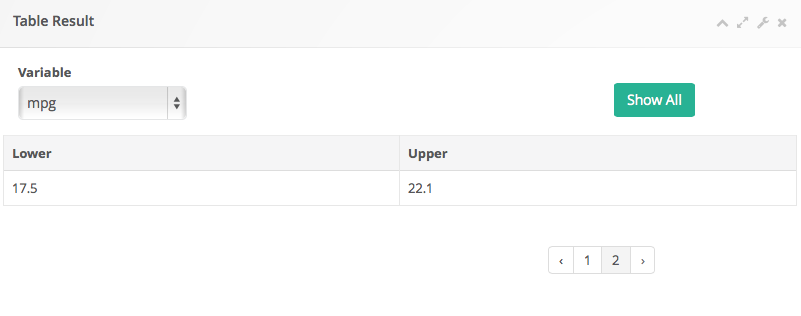

---------------------------------

- Display the One Sample Test results

----------------------------------

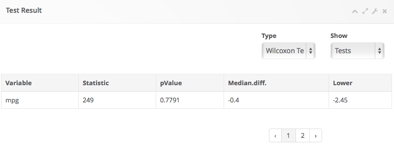

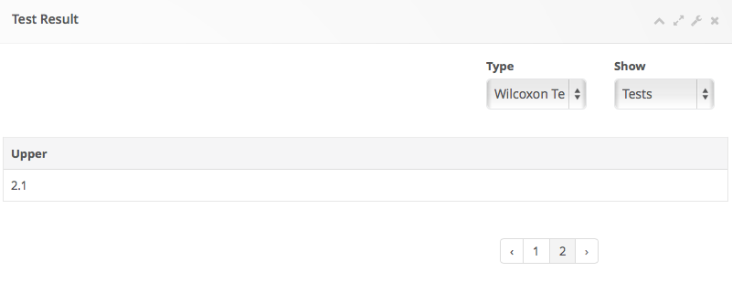

---------------------------------

- Display Shapiro-Wilk’s Normality Test result

----------------------------------

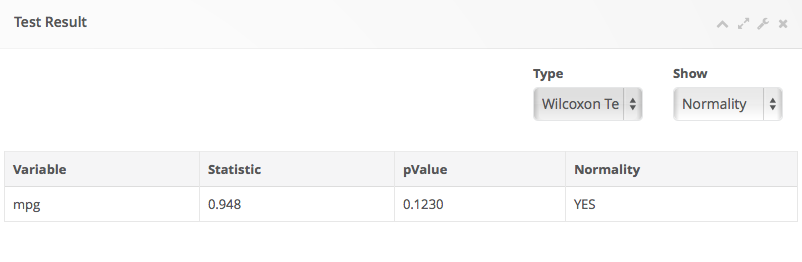

---------------------------------

- Display interactive plots:
- Box Plot

----------------------------------

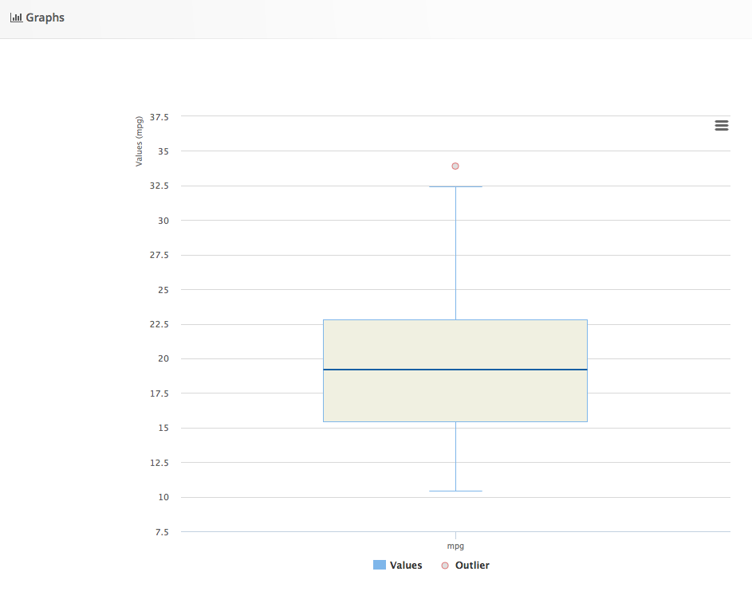

----------------------------------

Independent Two Samples Test
----------------------------

How to select this module?
~~~~~~~~~~~~~~~~~~~~~~~~~~

Parametric Tests 

Independent Two Samples Test

General aim
~~~~~~~~~~~~~~~~~~~~~~~~~~

- This module can be used to estimate the medians of two independent populations and to identify whether the differences of the distribution between two independent samples differs from 0 (or a test value).

What can you do using this module?
~~~~~~~~~~~~~~~~~~~~~~~~~~~~~~~~~~

- Compute several descriptive statistics to describe the distribution of numerical data and estimate the medians of two independent populations
- Identify whether the differences of the distribution between two independent samples differs from 0 (or a test value)
- Display the data distribution of variables with interactive boxplots
- Test whether the data distributed normally or not using Shapiro-Wilk’s test
- Test whether the group variances are homogeneous to each other

Usage
~~~~~~

Step 1: Define your variables from "Variables" tab:

- Select categorical variable(s) of interest(s) for descriptive statistics and comparison
- Select group variable(s) of interest(s) whose categories will be compared with each other
- Change the test value if necessary (to test whether the differences of the distribution between two independent samples are equal to a specified test value)

----------------------------------

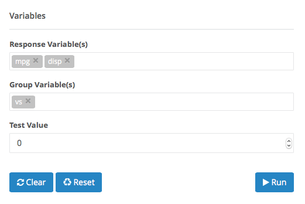

---------------------------------

.. note:: You may choose more options using following tabs:

"Statistics" tab

- Choose one or more available comparison tests: Mann-Whitney U or Kolmogorov-Smirnov Z tests
- Check the box for Shapiro-Wilk’s normality test
- Check the box for Levene variance homogeneity test with the location median or mean
- Select the type of alternative hypothesis
- Define the confidence level for hypothesis testing

----------------------------------

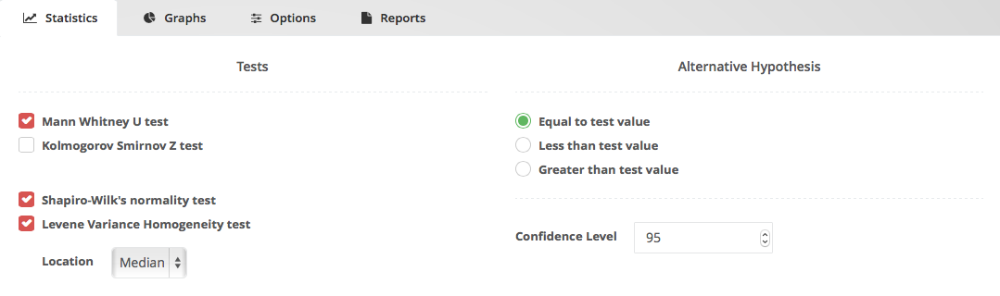

---------------------------------

"Graphs" tab

- Select Box Plot
- Identify what the error bars will represent: confidence intervals, standard errors or standard deviations

----------------------------------

.. figure:: images/help_img/nonparametricTests/independentTwoSamples/graphs.png
    :align: center
    :height: 650
    :width: 650
    :alt: independentTwoSamplesGraphs

---------------------------------

"Options" tab

- Identify the group variable categories that will be compared with each other
- Manage missing values with either complete case or by variable deletion
- Choose p value computation option as asymptotic or exact

----------------------------------

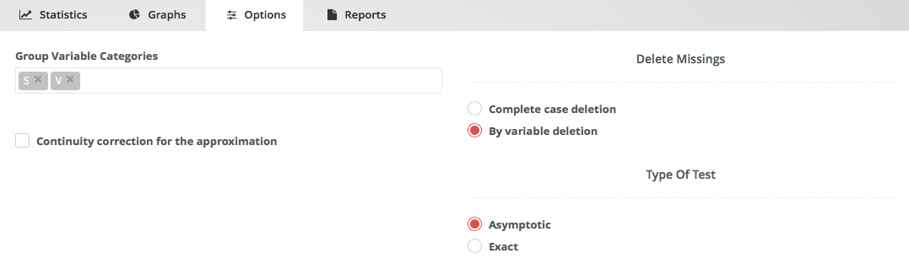

---------------------------------

Step 2: Get your desired outputs

- Display table with the descriptive statistics of the selected variables
- Switch between variables using combo-box button

----------------------------------

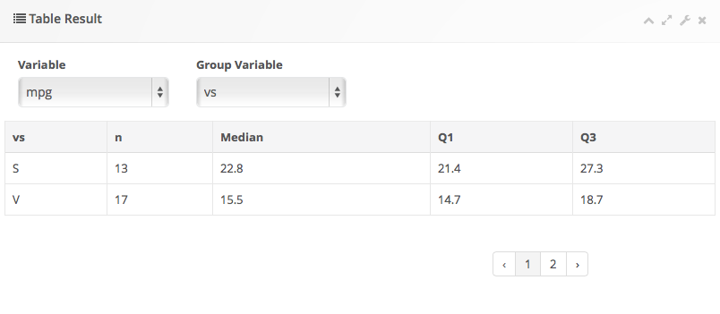

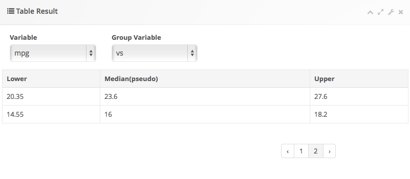

---------------------------------

- Display the Independent Two Samples Test results

----------------------------------

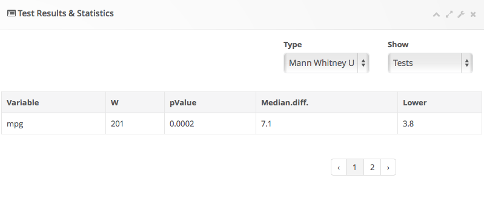

---------------------------------

- Display Shapiro-Wilk’s Normality Test result

----------------------------------

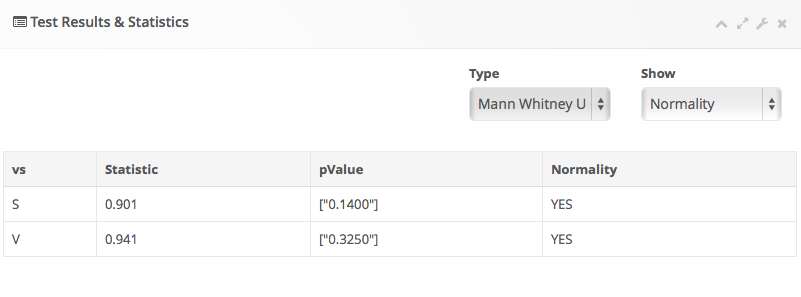

---------------------------------

- Display Levene's test for homogeneity result

----------------------------------

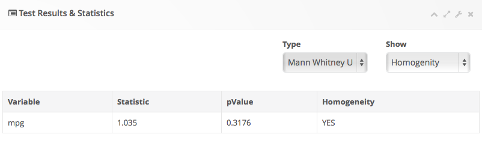

---------------------------------

- Display interactive plots:
- Box Plot

----------------------------------

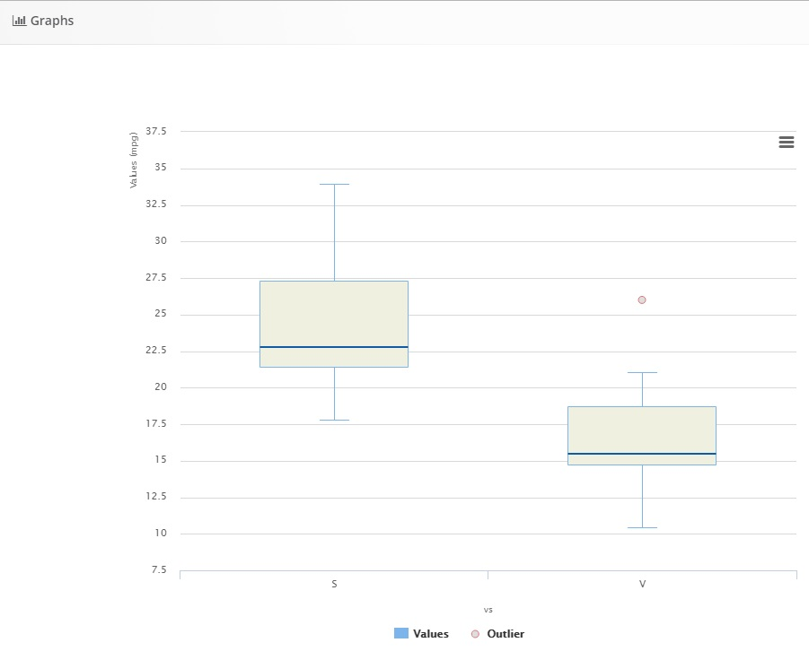

----------------------------------

Dependent Two Samples Test
----------------------------

How to select this module?
~~~~~~~~~~~~~~~~~~~~~~~~~~

Parametric Tests 

Dependent Two Samples Test

General aim
~~~~~~~~~~~~~~~~~~~~~~~~~~

- This module can be used to estimate the medians of two dependent populations and to identify whether the differences of the distribution between two paired samples differs from 0 (or a test value).

What can you do using this module?
~~~~~~~~~~~~~~~~~~~~~~~~~~~~~~~~~~

- Compute several descriptive statistics to describe the distribution of numerical data and estimate the medians of two independent populations
- Compute several descriptive statistics for differences
- Compare the estimated paired medians each other
- Compute the correlation estimates between paired samples
- Display the data distribution of variables with interactive boxplots
- Test whether the data distributed normally or not using Shapiro-Wilk’s test

Usage
~~~~~~

Step 1: Define your variables from "Variables" tab:

- Select the first numerical variable(s) of interest(s) from ‘Variable One’
- Select the second numerical variable(s) of interest(s) from ‘Variable Two’
- Change the test value if necessary (to test whether the differences of the distribution between two independent samples are equal to a specified test value)

----------------------------------

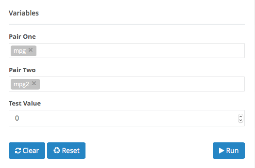

---------------------------------

.. note:: You may choose more options using following tabs:

"Statistics" tab

- Choose one or more available comparison tests: Wilcoxon and Sign tests
- Check the box for Shapiro-Wilk’s normality test
- Select the type of alternative hypothesis
- Define the confidence level for hypothesis testing

----------------------------------

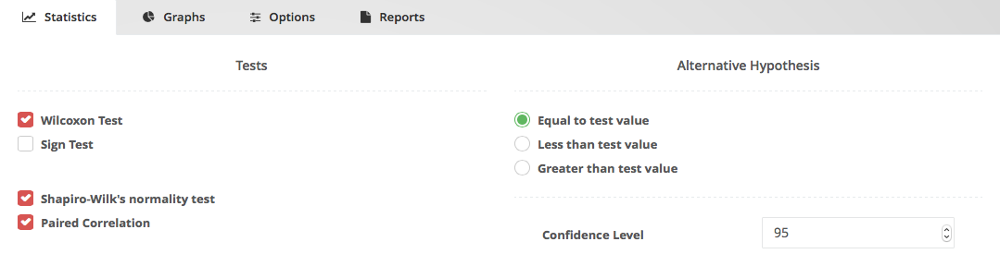

---------------------------------

"Graphs" tab

- Select Box Plot

----------------------------------

---------------------------------

Step 2: Get your desired outputs

- Display table with the descriptive statistics of the selected variables
- Switch between variables using combo-box button
- Check the box for paired correlations
- Check the box for descriptive statistics for differences (%)

----------------------------------

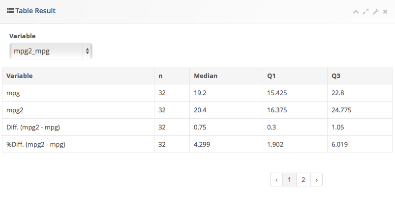

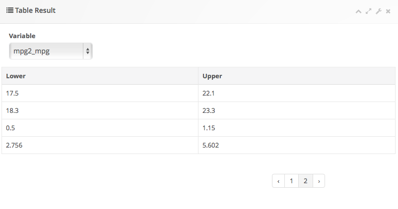

---------------------------------

- Display the Dependent Two Samples Test results

----------------------------------

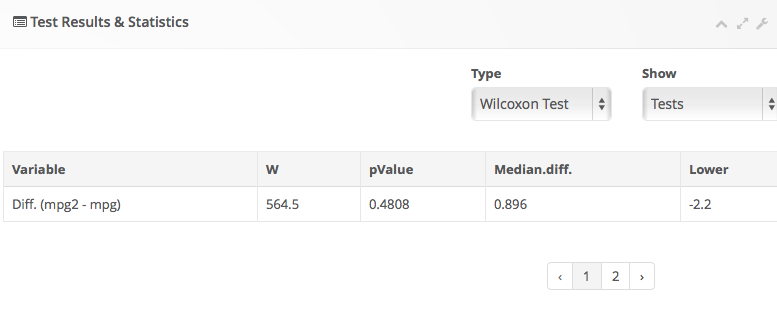

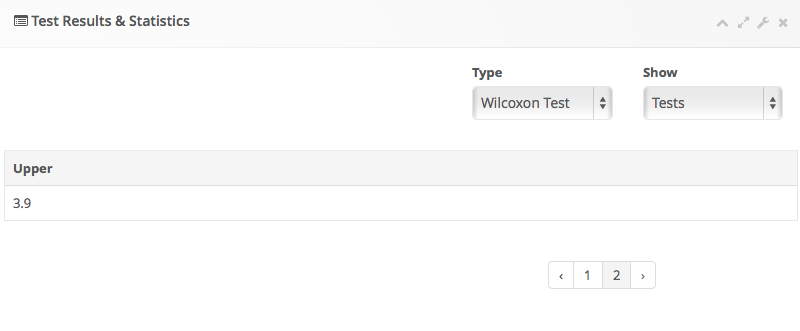

---------------------------------

- Display the correlation estimates between paired samples

----------------------------------

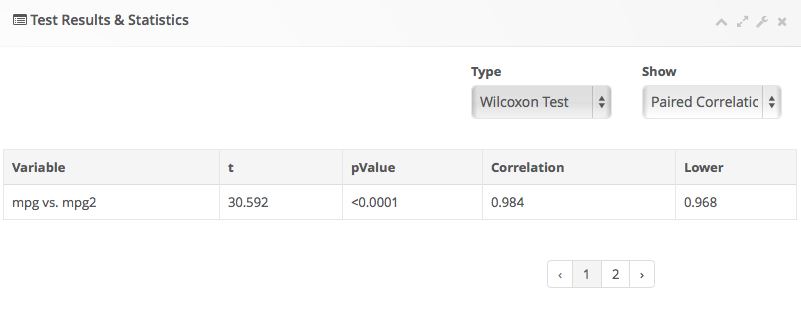

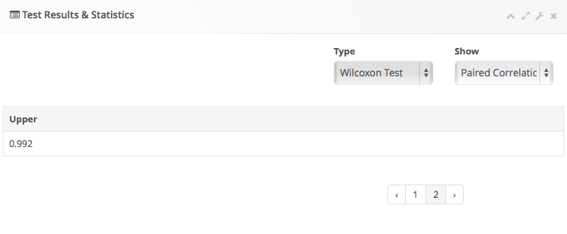

---------------------------------

- Display Shapiro-Wilk’s Normality Test result

----------------------------------

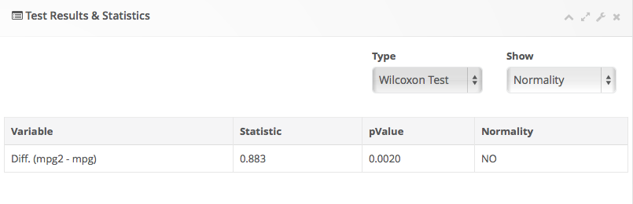

---------------------------------

- Display interactive plots:
- Box Plot

----------------------------------

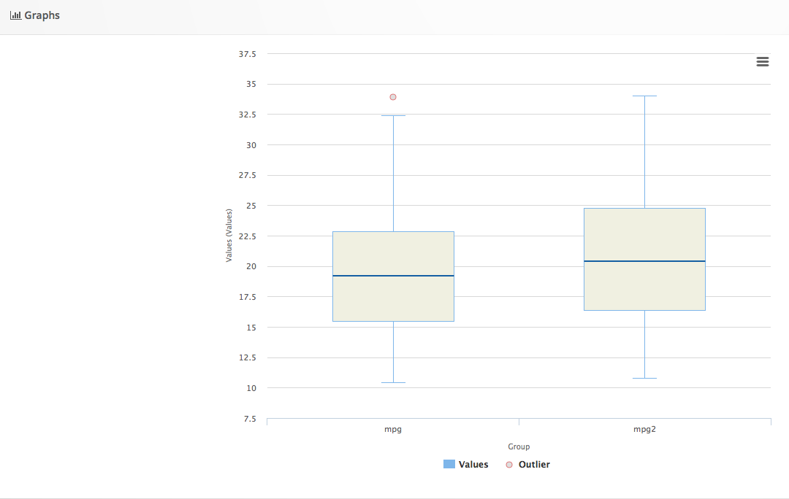

----------------------------------

Independent k Samples Test
----------------------------

How to select this module?
~~~~~~~~~~~~~~~~~~~~~~~~~~

Parametric Tests 

Independent k Samples Test

General aim
~~~~~~~~~~~~~~~~~~~~~~~~~~

- This module can be used to estimate the medians and compare the distributions of two or more independent populations.

What can you do using this module?
~~~~~~~~~~~~~~~~~~~~~~~~~~~~~~~~~~

- Compute several descriptive statistics to describe the distribution of numerical data and estimate the medians of two independent populations
- Compare the differences of the distribution among more than two independent samples
- Apply pairwise comparisons with one or more available post-hoc tests
- Display the data distribution of variables with interactive boxplots
- Test whether the data distributed normally or not using Shapiro-Wilk’s test
- Test whether the group variances are homogeneous to each other

Usage
~~~~~~

Step 1: Define your variables from "Variables" tab:

- Select response numerical variable(s) of interest(s) that will be used for comparison
- Select group variable(s) of interest(s) whose categories will be compared with each other

----------------------------------

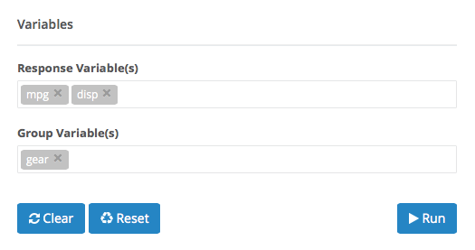

---------------------------------

.. note:: You may choose more options using following tabs:

"Statistics" tab

- Choose one or more available comparison tests: Kruskal-Wallis, Median and Van der Waerden scores tests
- Choose one or more available post-hoc tests: Siegel Castellan and Dunn’s
- Select the type of alternative hypothesis
- Define the confidence level for hypothesis testing
- Check the box for Shapiro-Wilk’s normality test
- Check the box for Levene variance homogeneity test with the location median or mean

----------------------------------

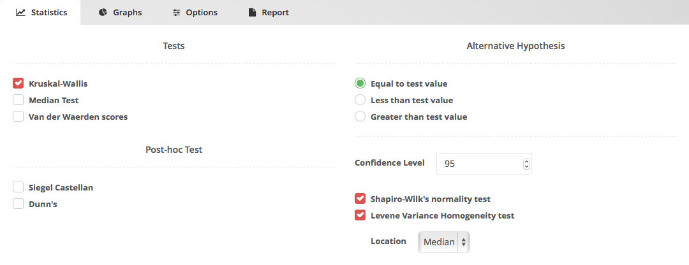

---------------------------------

"Graphs" tab

- Select Box Plot

----------------------------------

.. figure:: images/help_img/nonparametricTests/kIndependentSamples/graphs.png
    :align: center
    :height: 650
    :width: 650
    :alt: kIndependentSamplesGraphs

---------------------------------

"Options" tab

- SChoose p value computation option as asymptotic or exact
- Manage missing values with either complete case or by variable deletion

----------------------------------

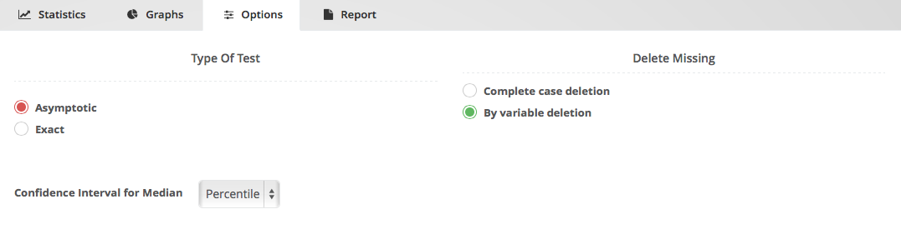

---------------------------------

Step 2: Get your desired outputs

- Display table with the descriptive statistics of the selected variables
- Switch between variables using combo-box button

----------------------------------

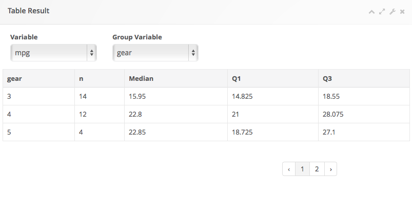

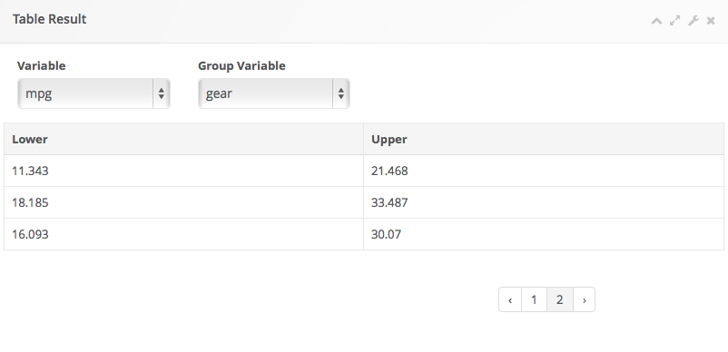

---------------------------------

- Display the Independent k Samples results

----------------------------------

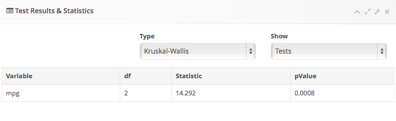

---------------------------------

- Display Shapiro-Wilk’s Normality Test result

----------------------------------

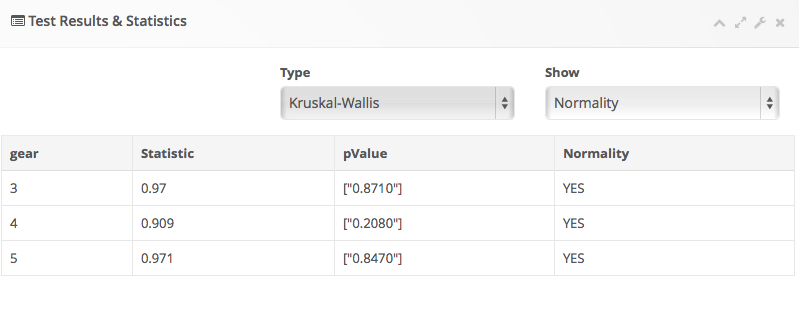

---------------------------------

- Display Levene variance homogeneity test result

----------------------------------

.. figure:: images/help_img/nonparametricTests/kIndependentSamples/testResults3.jpg
    :align: center
    :height: 650
    :width: 650
    :alt: kIndependentSamplesTestResults

---------------------------------

- Display interactive plots:
- Box Plot

----------------------------------

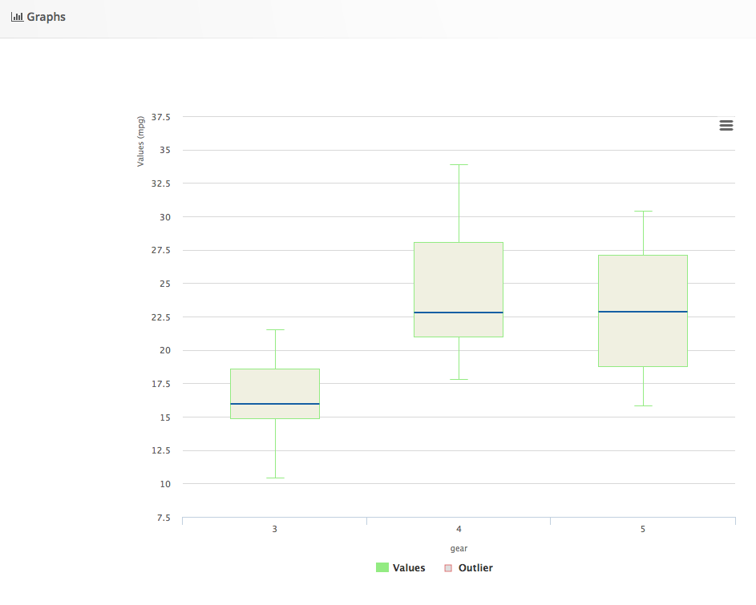

----------------------------------

