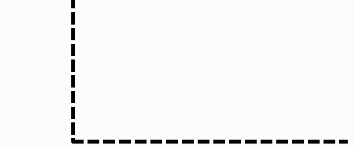
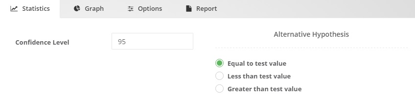
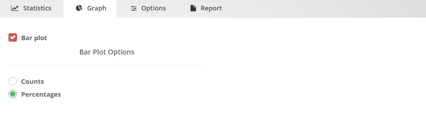

.. Assumptions / Limitations

Parametric Tests
===========================

‘Parametric Tests’ panel is used to estimate the population parameters (e.g. mean, variance and proportion) and compare them between groups, time points or user-specified custom values, when the parametric assumptions are met. Required test assumptions (e.g. data normality, variance homogeneity) are also available in each module, to assist the users on their decision to perform (or not perform) the right test module.

One Proportion Test
-------------------

How to select this module?
~~~~~~~~~~~~~~~~~~~~~~~~~~

Parametric Tests 

One Proportion Test

General aim
~~~~~~~~~~~~~~~~~~~~~~~~~~

- This module can be used to estimate the proportion of the population and compare whether it differs from a specified reference value.

What can you do using this module?
~~~~~~~~~~~~~~~~~~~~~~~~~~~~~~~~~~

- Compute several descriptive statistics to describe the distribution of categorical data and estimate the proportion of the population.
- Compare the estimated proportion with a specified reference value.
- Use asymptotic or exact test procedures in computation of p values.
- Display the data distribution of variables with interactive bar plots either for counts or percentages.

Usage
~~~~~~

Step 1: Define your variables from "Variables" tab:

- Select categorical variable(s) of interest(s) for descriptive statistics and comparison
- Enter the test proportion (the proportion to be compared)
- Use “Sample Input” if you will enter the necessary values of summarised data instead of using the entire data
- Click Run button to execute the analysis.

----------------------------------

---------------------------------

.. note:: You may choose more options using following tabs:

"Statistics" tab

- Define the confidence level for hypothesis testing.
- Select the type of alternative hypothesis.

----------------------------------

---------------------------------

"Graphs" tab

- Choose either counts or percentages to generate the bar plot(s).

----------------------------------

.. figure:: images/help_img/parametricTests/oneProportion/graphs.jpg
    :align: center
    :height: 650
    :width: 650
    :alt: oneProportionGraphs

---------------------------------

"Options" tab

- Choose p value computation option as asymptotic or exact.
- Identify the category that indicates the success.

----------------------------------

---------------------------------

Step 2: Get your desired outputs

- Display table with the descriptive statistics of the selected variables.
- Switch between variables and table representations using combo-box button.

----------------------------------

.. figure:: images/help_img/parametricTests/oneProportion/tableResults.jpg
    :align: center
    :height: 650
    :width: 650
    :alt: oneProportionResults

---------------------------------

- Display the One Proportion Test results

----------------------------------

.. figure:: images/help_img/parametricTests/oneProportion/testResults2.jpg
    :align: center
    :height: 650
    :width: 650
    :alt: oneProportionTestResults

---------------------------------

- Display interactive plots:
- Bar plot

----------------------------------

.. figure:: images/help_img/parametricTests/oneProportion/graphResults.jpg
    :align: center
    :height: 650
    :width: 650
    :alt: oneProportionScatterPlot

----------------------------------

Two Proportions Test
--------------------

How to select this module?
~~~~~~~~~~~~~~~~~~~~~~~~~~

Parametric Tests 

Two Proportions Test

General aim
~~~~~~~~~~~~~~~~~~~~~~~~~~

- This module can be used to estimate the proportions of two independent populations and compare them each other.

What can you do using this module?
~~~~~~~~~~~~~~~~~~~~~~~~~~~~~~~~~~

- Compute several descriptive statistics to describe the distribution of categorical data and estimate the proportions of two independent populations.
- Compare the estimated proportions each other.
- Use asymptotic or exact test procedures in computation of p values.
- Display the data distribution of variables with interactive bar plots either for counts or percentages.

Usage
~~~~~~

Step 1: Define your variables from "Variables" tab:

- Select response categorical variable(s) of interest(s) that will be used for comparison.
- Select group variable(s) of interest(s) whose categories will be compared with each other.
- Use “Sample Input” if you will enter the necessary values of summarised data instead of using the entire data.
- Click Run button to execute the analysis.

----------------------------------

---------------------------------

.. note:: You may choose more options using following tabs:

"Statistics" tab

- Define the confidence level for hypothesis testing.
- Select the type of alternative hypothesis.

----------------------------------

.. figure:: images/help_img/parametricTests/twoProportions/statistics.jpg
    :align: center
    :height: 750
    :width: 750
    :alt: twoProportionsStatistics

---------------------------------

"Graphs" tab

- Choose either counts or percentages to generate the bar plot(s).

----------------------------------

---------------------------------

"Options" tab

- Identify the group variable categories that will be compared with each other.
- Choose p value computation option as asymptotic or exact.
- Identify the category that indicates the success.
- Manage missing values with either complete case or by variable deletion.

----------------------------------

---------------------------------

Step 2: Get your desired outputs

- Display table with the descriptive statistics of the selected variables.
- Switch between variables using combo-box button.

----------------------------------

.. figure:: images/help_img/parametricTests/twoProportions/tableResults.jpg
    :align: center
    :height: 650
    :width: 650
    :alt: twoProportionsResults

---------------------------------

- Display the Two Proportion Test results.

----------------------------------

---------------------------------

- Display interactive plots:
- Bar plot

----------------------------------

----------------------------------

One Sample t Test
-----------------

How to select this module?
~~~~~~~~~~~~~~~~~~~~~~~~~~

Parametric Tests 

One Sample t Test

General aim
~~~~~~~~~~~~~~~~~~~~~~~~~~

- This module can be used to estimate the mean of the population and compare whether it differs from a specified reference value.

What can you do using this module?
~~~~~~~~~~~~~~~~~~~~~~~~~~~~~~~~~~

- Compute several descriptive statistics to describe the distribution of numerical data and estimate the mean of the population.
- Compare the estimated mean with a specified reference value.
- Display the data distribution of variables with interactive error bar plots and boxplots.
- Test whether the data distributed normally or not using Shapiro-Wilk’s test.

Usage
~~~~~~

Step 1: Define your variables from "Variables" tab:

- Select numerical variable(s) of interest(s) for descriptive statistics and comparison.
- Enter the test value (the mean to be compared).
- Click Run button to execute the analysis.

----------------------------------

.. figure:: images/help_img/parametricTests/oneSampleT/variables.jpg
    :align: center
    :height: 400
    :width: 400
    :alt: oneSampleTVariables

---------------------------------

.. note:: You may choose more options using following tabs:

"Statistics" tab

- Define the confidence level for hypothesis testing.
- Check the box for Shapiro-Wilk’s normality test.
- Select the type of alternative hypothesis.

----------------------------------

---------------------------------

"Graphs" tab

- Choose one or more available graphs: Error bar and Box Plot.
- Identify what the error bars will represent: confidence intervals, standard errors or standard deviations.

----------------------------------

---------------------------------

Step 2: Get your desired outputs

- Display table with the descriptive statistics of the selected variables.
- Switch between variables using combo-box button.
- Click ‘Show All’ to display results for all variables in same screen.

----------------------------------

---------------------------------

- Display Shapiro-Wilk’s Normality Test result

----------------------------------

.. figure:: images/help_img/parametricTests/oneSampleT/testResults2.jpg
    :align: center
    :height: 650
    :width: 650
    :alt: oneSampleTTestResults

---------------------------------

- Display one sample t test result.

----------------------------------

.. figure:: images/help_img/parametricTests/oneSampleT/testResults.jpg
    :align: center
    :height: 650
    :width: 650
    :alt: oneSampleTTestResults

---------------------------------

- Display interactive plots:
- Error bar

----------------------------------

.. figure:: images/help_img/parametricTests/oneSampleT/graphResults.jpg
    :align: center
    :height: 650
    :width: 650
    :alt: oneSampleTScatterPlot

----------------------------------

- Error bar

----------------------------------

----------------------------------

Independent Two Samples t Test
-----------------------------

How to select this module?
~~~~~~~~~~~~~~~~~~~~~~~~~~

Parametric Tests 

Independent Two Samples t Test

General aim
~~~~~~~~~~~~~~~~~~~~~~~~~~

- This module can be used to estimate the mean of two independent populations and compare them each other.

What can you do using this module?
~~~~~~~~~~~~~~~~~~~~~~~~~~~~~~~~~~

- Compute several descriptive statistics to describe the distribution of numerical data and estimate the means of two independent populations.
- Compare the estimated means each other using t test.
- Compare the estimated means each other using Welch test, if the group variances are heterogeneous to each other.
- Display the data distribution of variables with interactive error bar plots and boxplots.
- Test whether the data distributed normally or not using Shapiro-Wilk’s test.
- Test whether the group variances are homogeneous to each other.

Usage
~~~~~~

Step 1: Define your variables from "Variables" tab:

- Select response numerical variable(s) of interest(s) that will be used for comparison.
- Select group variable(s) of interest(s) whose categories will be compared with each other.
- Change the test value if necessary (to test whether the mean differences are equal to a specified test value).
- Click Run button to execute the analysis.

----------------------------------

.. figure:: images/help_img/parametricTests/independentTwoSamplesT/variables.jpg
    :align: center
    :height: 400
    :width: 400
    :alt: independentTwoSamplesTVariables

---------------------------------

.. note:: You may choose more options using following tabs:

"Statistics" tab

- Define the confidence level for hypothesis testing.
- Check the box for Shapiro-Wilk’s normality test.
- Check the box for Levene variance homogeneity test with the location median or mean.
- Select the type of alternative hypothesis.

----------------------------------

---------------------------------

"Graphs" tab

- Choose one or more available graphs: Error bar and Box Plot.
- Identify what the error bars will represent: confidence intervals, standard errors or standard deviations.

----------------------------------

.. figure:: images/help_img/parametricTests/independentTwoSamplesT/graphs.jpg
    :align: center
    :height: 650
    :width: 650
    :alt: independentTwoSamplesTGraphs

---------------------------------

"Options" tab

- Identify the group variable categories that will be compared with each other.
- Manage missing values with either complete case or by variable deletion.

----------------------------------

---------------------------------

Step 2: Get your desired outputs

- Display table with the descriptive statistics of the selected variables.
- Switch between variables using combo-box button.

----------------------------------

---------------------------------

- Display Shapiro-Wilk’s Normality Test result.

----------------------------------

---------------------------------

- Display Levene variance homogeneity test result.

----------------------------------

.. figure:: images/help_img/parametricTests/independentTwoSamplesT/testResults6.jpg
    :align: center
    :height: 650
    :width: 650
    :alt: independentTwoSamplesTTestResults

---------------------------------

- Display the Independent Two Samples t Test results.

----------------------------------

.. figure:: images/help_img/parametricTests/independentTwoSamplesT/testResults.jpg
    :align: center
    :height: 650
    :width: 650
    :alt: oneSampleTTestResults

---------------------------------

- Display Welch Test result if the group variances are heterogeneous to each other

----------------------------------

.. figure:: images/help_img/parametricTests/independentTwoSamplesT/testResults3.jpg
    :align: center
    :height: 650
    :width: 650
    :alt: oneSampleTTestResults

.. figure:: images/help_img/parametricTests/independentTwoSamplesT/testResults4.jpg
    :align: center
    :height: 650
    :width: 650
    :alt: independentTwoSamplesTTestResults

---------------------------------

- Display interactive plots:
- Error bar

----------------------------------

.. figure:: images/help_img/parametricTests/independentTwoSamplesT/graphResults.jpg
    :align: center
    :height: 650
    :width: 650
    :alt: independentTwoSamplesTScatterPlot

----------------------------------

- Error bar

----------------------------------

.. figure:: images/help_img/parametricTests/independentTwoSamplesT/graphResults2.jpg
    :align: center
    :height: 650
    :width: 650
    :alt: independentTwoSamplesTScatterPlot

----------------------------------

Dependent Two Samples t Test
-----------------------------

How to select this module?
~~~~~~~~~~~~~~~~~~~~~~~~~~

Parametric Tests 

Dependent Two Samples t Test

General aim
~~~~~~~~~~~~~~~~~~~~~~~~~~

- This module can be used to estimate and compare the mean of two dependent populations and compare them each other.

What can you do using this module?
~~~~~~~~~~~~~~~~~~~~~~~~~~~~~~~~~~

- Compute several descriptive statistics to describe the distribution of numerical data and estimate the means of two dependent populations.
- Compute several descriptive statistics for differences.
- Compare the estimated paired means each other.
- Compute the correlation estimates between paired samples.
- Display the data distribution of variables with interactive error bar plots and boxplots.
- Test whether the data distributed normally or not using Shapiro-Wilk’s test.

Usage
~~~~~~

Step 1: Define your variables from "Variables" tab:

- Select the first numerical variable(s) of interest(s) from ‘Variable One’.
- Select the second numerical variable(s) of interest(s) from ‘Variable Two’.
- Change the test value if necessary (to test whether the mean differences are equal to a specified test value).
- Click Run button to execute the analysis.

----------------------------------

.. figure:: images/help_img/parametricTests/dependentTwoSamplesT/variables.png
    :align: center
    :height: 400
    :width: 400
    :alt: dependentTwoSamplesTVariables

---------------------------------

.. note:: You may choose more options using following tabs:

"Statistics" tab

- Define the confidence level for hypothesis testing.
- Check the box for Shapiro-Wilk’s normality test.
- Check the box for paired correlations.
- Check the box for descriptive statistics for differences (%)
- Select the type of alternative hypothesis

----------------------------------

---------------------------------

"Graphs" tab

- Choose one or more available graphs: Error bar and Box Plot
- Identify what the error bars will represent: confidence intervals, standard errors or standard deviations

----------------------------------

.. figure:: images/help_img/parametricTests/dependentTwoSamplesT/graphs.png
    :align: center
    :height: 650
    :width: 650
    :alt: dependentTwoSamplesTGraphs

---------------------------------

Step 2: Get your desired outputs

- Display table with the descriptive statistics of the selected variables
- Switch between variables using combo-box button

----------------------------------

.. figure:: images/help_img/parametricTests/dependentTwoSamplesT/tableResults2.png
    :align: center
    :height: 650
    :width: 650
    :alt: dependentTwoSamplesTResults

---------------------------------

- Display Shapiro-Wilk’s Normality Test result.

----------------------------------

---------------------------------

- Display the correlation estimates between paired samples.

----------------------------------

.. figure:: images/help_img/parametricTests/dependentTwoSamplesT/testResults3.png
    :align: center
    :height: 650
    :width: 650
    :alt: oneSampleTTestResults

---------------------------------

- Display the Dependent Two Samples t Test results.

----------------------------------

.. figure:: images/help_img/parametricTests/dependentTwoSamplesT/testResults.png
    :align: center
    :height: 650
    :width: 650
    :alt: oneSampleTTestResults

---------------------------------

- Display interactive plots:
- Error bar

----------------------------------

----------------------------------

- Error bar

----------------------------------

.. figure:: images/help_img/parametricTests/dependentTwoSamplesT/graphResults2.png
    :align: center
    :height: 650
    :width: 650
    :alt: dependentTwoSamplesTScatterPlot

----------------------------------

One Way ANOVA Test
------------------

How to select this module?
~~~~~~~~~~~~~~~~~~~~~~~~~~

Parametric Tests 

One-Way ANOVA Test

General aim
~~~~~~~~~~~~~~~~~~~~~~~~~~

- This module can be used to estimate the mean of two or more independent populations and compare them each other.

What can you do using this module?
~~~~~~~~~~~~~~~~~~~~~~~~~~~~~~~~~~

- Compute several descriptive statistics to describe the distribution of numerical data and estimate the means of two dependent populations.
- Compare the estimated means each other using F test.
- Compare the estimated means each other using Welch test, if the group variances are heterogeneous to each other.
- Apply pairwise comparisons with one or more available post-hoc tests.
- Display the data distribution of variables with interactive error bar plots and boxplots.
- Test whether the data distributed normally or not using Shapiro-Wilk’s test.
- Test whether the group variances are homogeneous to each other.

Usage
~~~~~~

Step 1: Define your variables from "Variables" tab:

- Select response numerical variable(s) of interest(s) that will be used for comparison
- Select group variable(s) of interest(s) whose categories will be compared with each other

----------------------------------

---------------------------------

.. note:: You may choose more options using following tabs:

"Statistics" tab

- Define the confidence level for hypothesis testing.
- Check the box for Shapiro-Wilk’s normality test.
- Check the box for Levene variance homogeneity test with the location median or mean.
- Check the box for Welch test.

----------------------------------

.. figure:: images/help_img/parametricTests/oneWayANOVA/statistics.jpg
    :align: center
    :height: 750
    :width: 750
    :alt: oneWayANOVAStatistics

---------------------------------

"Graphs" tab

- Choose one or more available graphs: Error bar and Box Plot
- Identify what the error bars will represent: confidence intervals, standard errors or standard deviations

----------------------------------

---------------------------------

"Options" tab

- Manage missing values with either complete case or by variable deletion.

----------------------------------

---------------------------------

Step 2: Get your desired outputs

- Display table with the descriptive statistics of the selected variables.
- Switch between variables using combo-box button.

----------------------------------

---------------------------------

- Display Shapiro-Wilk’s Normality Test result

----------------------------------

---------------------------------

- Display the One-Way ANOVA results

----------------------------------

---------------------------------

- Display Levene variance homogeneity test result.

----------------------------------

.. figure:: images/help_img/parametricTests/oneWayANOVA/testResults4.jpg
    :align: center
    :height: 650
    :width: 650
    :alt: oneWayANOVATestResults

----------------------------------  

- Display Welch Test result if the group variances are heterogeneous to each other.

----------------------------------    

---------------------------------

- Display interactive plots:
- Error bar

----------------------------------

.. figure:: images/help_img/parametricTests/oneWayANOVA/graphResults.jpg
    :align: center
    :height: 650
    :width: 650
    :alt: oneWayANOVAErrorBar

----------------------------------

- Error bar

----------------------------------

.. figure:: images/help_img/parametricTests/oneWayANOVA/graphResults2.jpg
    :align: center
    :height: 650
    :width: 650
    :alt: oneWayANOVABoxPlot

----------------------------------

Two Way ANOVA Test
------------------

How to select this module?
~~~~~~~~~~~~~~~~~~~~~~~~~~

Parametric Tests 

Two-Way ANOVA Test

General aim
~~~~~~~~~~~~~~~~~~~~~~~~~~

- This module can be used to estimate and compares whether the group means are different in case of two categorical factor variables.

What can you do using this module?
~~~~~~~~~~~~~~~~~~~~~~~~~~~~~~~~~~

- Compute several descriptive statistics to describe the distribution of numerical data and estimate the means in case of two categorical factor variables.
- Compare the estimated means in case of two categorical factor variables using F test.
- Apply pairwise comparisons with one or more available post-hoc tests.
- Display the data distribution of variables with main effects and interaction plots.
- Test whether the data distributed normally or not using Shapiro-Wilk’s test.
- Test whether the group variances are homogeneous to each other.

Usage
~~~~~~

Step 1: Define your variables from "Variables" tab:

- Select response numerical variable(s) of interest(s) that will be used for comparison.
- Select two group variables of interests whose effect on the response variable is investigated.

----------------------------------

.. figure:: images/help_img/parametricTests/twoWayANOVA/variables.jpg
    :align: center
    :height: 400
    :width: 400
    :alt: twoWayANOVAVariables

---------------------------------

.. note:: You may choose more options using following tabs:

"Statistics" tab

- Define the confidence level for hypothesis testing
- Check the box for Shapiro-Wilk’s normality test
- Check the box for Levene variance homogeneity test with the location median or mean

----------------------------------

.. figure:: images/help_img/parametricTests/twoWayANOVA/statistics.jpg
    :align: center
    :height: 750
    :width: 750
    :alt: twoWayANOVAStatistics

---------------------------------

"Graphs" tab

- Choose one or more available graphs: Main Effects Plot and Interaction Plot
- Identify the style of display: only means or mean and error bars

----------------------------------

.. figure:: images/help_img/parametricTests/twoWayANOVA/graphs.jpg
    :align: center
    :height: 650
    :width: 650
    :alt: twoWayANOVAGraphs

---------------------------------

"Options" tab

- Identify the contrasts for each factor: treatment, polynomial, helmert or sum
- Select the type of sum of squares: type I, type II or type III
- Manage missing values with either complete case or by variable deletion
- Select the type of Anova model: full model or main effects model

----------------------------------

---------------------------------

Step 2: Get your desired outputs

- Display table with the descriptive statistics of the selected variables
- Switch between variables using combo-box button

----------------------------------

.. figure:: images/help_img/parametricTests/twoWayANOVA/tableResults2.jpg
    :align: center
    :height: 650
    :width: 650
    :alt: twoWayANOVAResults

---------------------------------

- Display Shapiro-Wilk’s Normality Test result

----------------------------------

.. figure:: images/help_img/parametricTests/twoWayANOVA/testResults5.jpg
    :align: center
    :height: 650
    :width: 650
    :alt: twoWayANOVATestResults

---------------------------------

- Display the Two-Way ANOVA results

----------------------------------

.. figure:: images/help_img/parametricTests/twoWayANOVA/testResults.jpg
    :align: center
    :height: 650
    :width: 650
    :alt: twoSampleTTestResults

.. figure:: images/help_img/parametricTests/twoWayANOVA/testResults2.jpg
    :align: center
    :height: 650
    :width: 650
    :alt: twoSampleTTestResults    

---------------------------------

- Display Levene variance homogeneity test result.

----------------------------------

.. figure:: images/help_img/parametricTests/twoWayANOVA/testResults6.jpg
    :align: center
    :height: 650
    :width: 650
    :alt: twoWayANOVATestResults

----------------------------------  

- Display the estimated parameters

----------------------------------    

.. figure:: images/help_img/parametricTests/twoWayANOVA/testResults3.jpg
    :align: center
    :height: 650
    :width: 650
    :alt: twoWayANOVATestResults

---------------------------------

- Display interactive plots:
- Main effects plot

----------------------------------

----------------------------------

- Interaction plot

----------------------------------

----------------------------------

One Variance Test
------------------

How to select this module?
~~~~~~~~~~~~~~~~~~~~~~~~~~

Parametric Tests 

One Variance Test

General aim
~~~~~~~~~~~~~~~~~~~~~~~~~~

- This module can be used to estimate the variance of the population and compare whether it differs from a specified reference value.

What can you do using this module?
~~~~~~~~~~~~~~~~~~~~~~~~~~~~~~~~~~

- Compute several descriptive statistics to describe the distribution of numerical data and estimate the mean of the population
- Compare the estimated variance with a specified reference value
- Display the data distribution of variables with interactive error bar plots and boxplots
- Test whether the data distributed normally or not using Shapiro-Wilk’s test

Usage
~~~~~~

Step 1: Define your variables from "Variables" tab:

- Select response numerical variable(s) of interest(s) that will be used for comparison
- Enter the test variance (the variance to be compared)
- Use “Sample Input” if you will enter the necessary values of summarised data instead of using the entire data

----------------------------------

.. figure:: images/help_img/parametricTests/oneVariance/variables.jpg
    :align: center
    :height: 400
    :width: 400
    :alt: oneVarianceVariables

---------------------------------

.. note:: You may choose more options using following tabs:

"Statistics" tab

- Define the confidence level for hypothesis testing
- Check the box for Shapiro-Wilk’s normality test
- Select the type of alternative hypothesis

----------------------------------

---------------------------------

"Graphs" tab

- Choose one or more available graphs: Error bar and Box Plot
- Identify what the error bars will represent: confidence intervals, standard errors or standard deviations

----------------------------------

---------------------------------

Step 2: Get your desired outputs

- Display table with the descriptive statistics of the selected variables
- Switch between variables using combo-box button
- Click ‘Show All’ to display results for all variables in same screen

----------------------------------

.. figure:: images/help_img/parametricTests/oneVariance/tableResults.jpg
    :align: center
    :height: 650
    :width: 650
    :alt: oneVarianceResults

---------------------------------

- Display Shapiro-Wilk’s Normality Test result

----------------------------------

.. figure:: images/help_img/parametricTests/oneVariance/testResults2.jpg
    :align: center
    :height: 650
    :width: 650
    :alt: oneVarianceTestResults

---------------------------------

- Display the One Variance Test results

----------------------------------

---------------------------------

- Display interactive plots:
- Error Bar

----------------------------------

.. figure:: images/help_img/parametricTests/oneVariance/graphResults.jpg
    :align: center
    :height: 650
    :width: 650
    :alt: oneVarianceANOVAErrorBar

----------------------------------

- Box Plot

----------------------------------

----------------------------------

Two Variance Test
------------------

How to select this module?
~~~~~~~~~~~~~~~~~~~~~~~~~~

Parametric Tests 

Two Variance Test

General aim
~~~~~~~~~~~~~~~~~~~~~~~~~~

- This module can be used to estimate the variance of two independent populations and compare them each other.

What can you do using this module?
~~~~~~~~~~~~~~~~~~~~~~~~~~~~~~~~~~

- Compute several descriptive statistics to describe the distribution of numerical data and estimate the mean of the population
- Compare the estimated variance with a specified reference value
- Display the data distribution of variables with interactive error bar plots and boxplots
- Test whether the data distributed normally or not using Shapiro-Wilk’s test

Usage
~~~~~~

Step 1: Define your variables from "Variables" tab:

- Select response numerical variable(s) of interest(s) that will be used for comparison
- Select group variable(s) of interest(s) whose categories will be compared with each other
- Use “Sample Input” if you will enter the necessary values of summarised data instead of using the entire data

----------------------------------

.. figure:: images/help_img/parametricTests/twoVariances/variables.jpg
    :align: center
    :height: 400
    :width: 400
    :alt: twoVarianceVariables

---------------------------------

.. note:: You may choose more options using following tabs:

"Statistics" tab

- Define the confidence level for hypothesis testing
- Check the box for Shapiro-Wilk’s normality test
- Select the type of alternative hypothesis
- Choose one or more available comparison tests: F, Levene and Bartlett tests

----------------------------------

---------------------------------

"Graphs" tab

- Choose one or more available graphs: Error bar and Box Plot
- Identify what the error bars will represent: confidence intervals, standard errors or standard deviations

----------------------------------

---------------------------------

"Options" tab

- Identify the group variable categories that will be compared with each other
- Manage missing values with either complete case or by variable deletion

----------------------------------

---------------------------------

Step 2: Get your desired outputs

- Display table with the descriptive statistics of the selected variables
- Switch between variables using combo-box button

----------------------------------

.. figure:: images/help_img/parametricTests/twoVariances/tableResults.jpg
    :align: center
    :height: 650
    :width: 650
    :alt: twoVarianceResults

---------------------------------

- Display Shapiro-Wilk’s Normality Test result

----------------------------------

.. figure:: images/help_img/parametricTests/twoVariances/testResults2.jpg
    :align: center
    :height: 650
    :width: 650
    :alt: twoVarianceTestResults

---------------------------------

- Display the Two Variance Test results

----------------------------------

.. figure:: images/help_img/parametricTests/twoVariances/testResults.jpg
    :align: center
    :height: 650
    :width: 650
    :alt: twoSampleTTestResults

---------------------------------

- Display interactive plots:
- Error Bar

----------------------------------

.. figure:: images/help_img/parametricTests/twoVariances/graphResults.jpg
    :align: center
    :height: 650
    :width: 650
    :alt: twoVarianceANOVAErrorBar

----------------------------------

- Box Plot

----------------------------------

.. figure:: images/help_img/parametricTests/twoVariances/graphResults2.jpg
    :align: center
    :height: 650
    :width: 650
    :alt: twoVarianceANOVABoxPlot

----------------------------------

